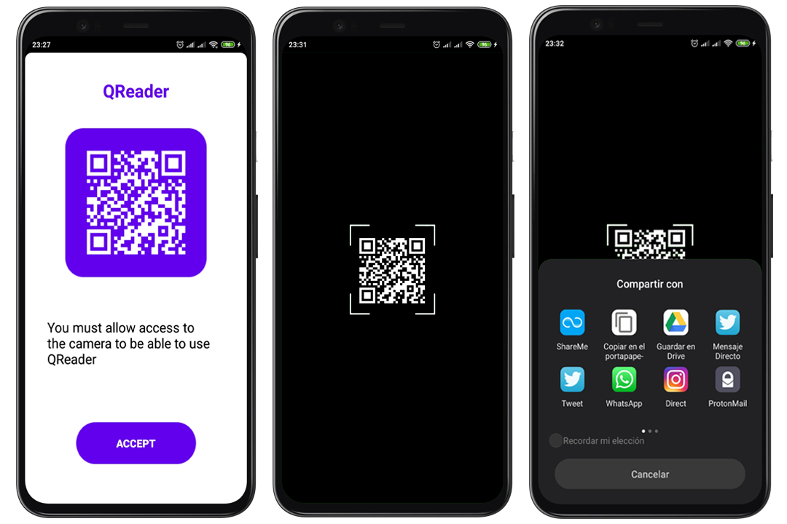

# QReader
QR reader and scanner made in Java for Android.

## :rocket: Features
* Item numbers (EAN, ISBN, UPC, JAN, GTIN-13)
* Barcode
* Code 39, Code 93 y Code 128
* Interleaved 2 of 5 (ITF)
* PDF417
* GS1 DataBar (RSS-14)
* Code Aztec
* Data Matrix

## :iphone: [Play Store](https://play.google.com/store/apps/details?id=com.waniapp.qrcode.scanner.reader.android)

